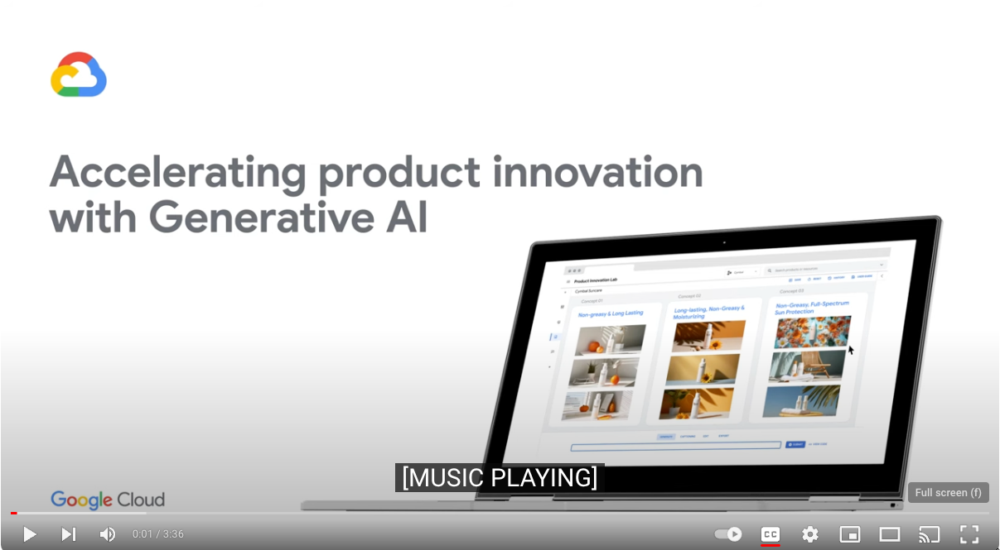
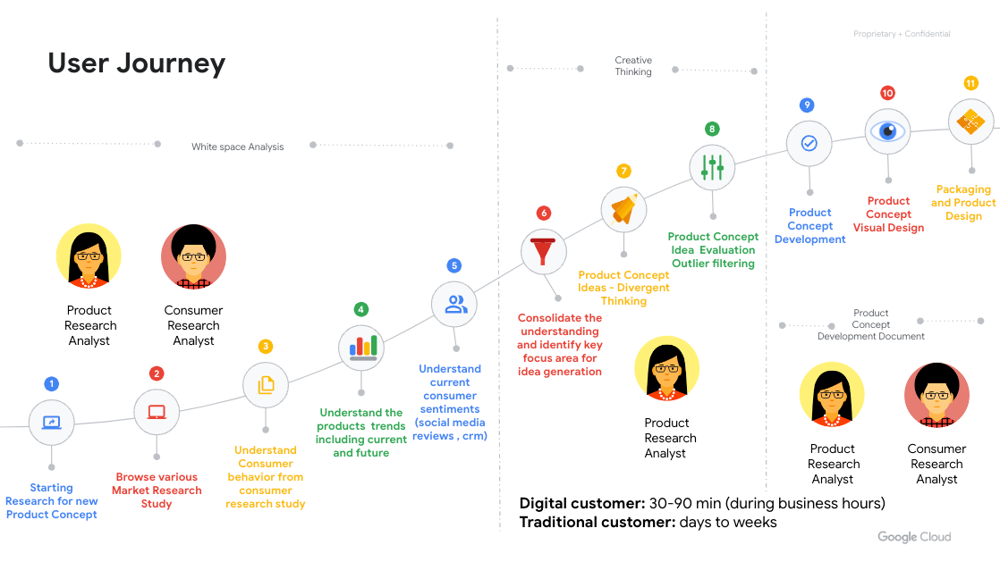
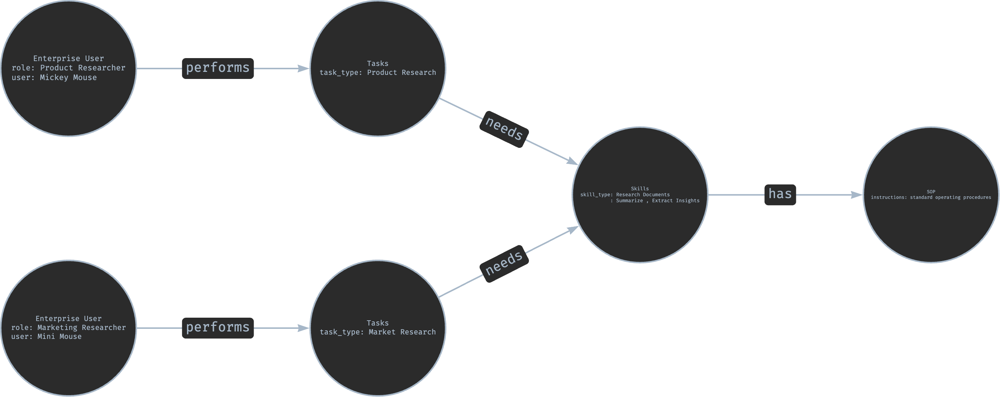
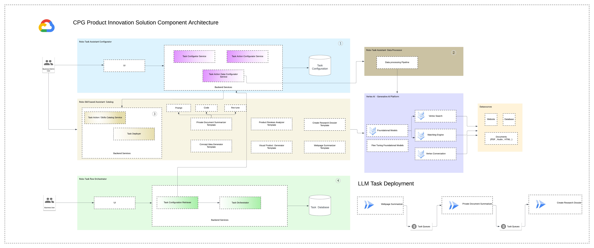
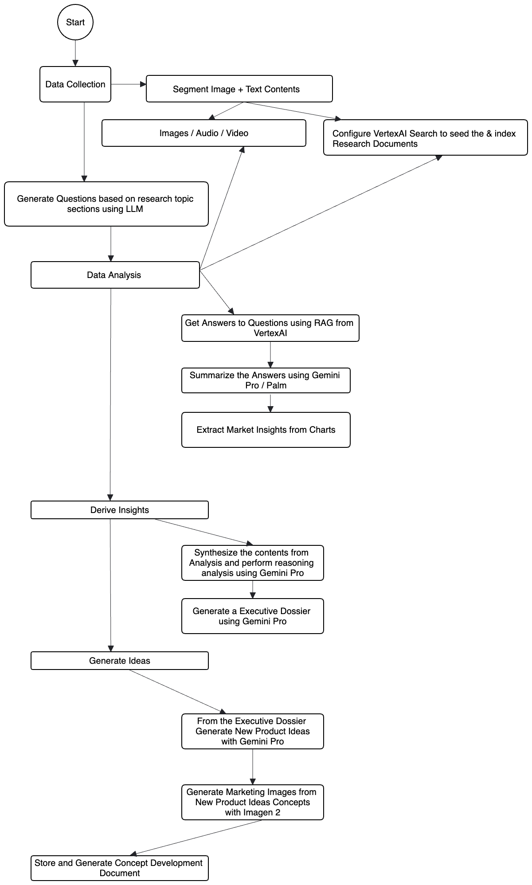
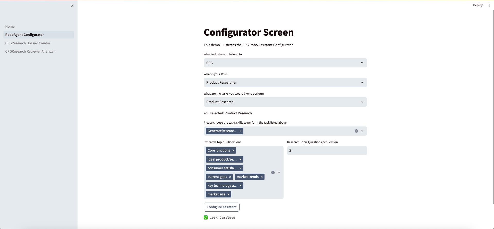

# MetaGemini: The Multi-Agent Framework Concept for VertexAI LLM's

<p align="center">
<a href=""></a>
</p>

I was inspired by the Demonstration showcased @ Next  on leveraging LLM for complex tasks

<p align="center"><a href="https://www.youtube.com/watch?v=R9Z1Tlt9QKU"></a></p>


1. In this prototype, i have customized MetaGPT and ported to support VertexAI as the LLM provider to take a **one line requirement** as input and outputs ** Whitespace Analysis Dossier , Generates Consumer Research Analysis and finally generates the Concept Development Document.**
2. Internally, MetaGemini Concept includes **product research analyst / market researcher / product concept developer.** It provides the entire process of a **software company along with carefully orchestrated SOPs.**
   1. `Code = SOP(Team)` is the core philosophy. We materialize SOP and apply it to teams composed of LLMs.



<p align="center">CPG Company Multi-Role Schematic (Gradually Implementing)</p>

## MetaGemini Concept

The current prototype explores LLM-based multi-agent systems, spotlighting the framework, MetaGemini extension of Metagpt, and its potential as multi-agent systems, to replicate and enhance human workflows as described in the above schematic.

The idea is to prove fostering of effective collaboration, both conversationally and through tool-based interactions. The diagram below highlights the representation of human tasks.We know that, through prolonged collaborative practice, humans have developed widely accepted Standardized Operating Procedures (SOPs) across various domains.

These SOPs, which play a pivotal role in task decomposition and efficient coordination, ensure tasks are executed consistently and accurately, aligning with defined roles and quality standards.




## Agent Concept

Like depicted in the schematic above , idea of the framework is to create a foundation for Agents specialized in performing specific skills , in our example CPG Product Research Agent is trained or customized to perform
specialized tasks which has the following skills. 

- Whitespace Analysis 
- Creative Thinking
- Creative Content Generation

These skills are like lego blocks , where we can customize each of them for various applications like CPG Research , Financial Analysis , Product troubleshooting etc
Using the framework we have demonstrated how we can create a common catalog of skill based agents , which can then be used by Enterprise to perform various specialized tasks.


## MetaGemini Abilities

1. Conduct Whitespace Analysis from the documents stored in VertexAI Search
2. Conduct Review Analysis with Clustering and Sentiment Analysis
3. Understand Market Research visual charts using Gemini Vision Pro
4. Create an Executive Dossier consolidating the information gathered in previous tasks.
5. Another Agent takes the output of the Whitespace Analysis and generates new Product Areas.


## MetaGemini Architecture

MetaGPT is just a concept , in order to take the concept idea to production , there are several gaps which we need to address 

- Make it distributable
- Make it Standardized to develop Agents with Specialized skills
- Make it scalable and easily deployable
- Catalog to discovering and publishing for Developers
- UI to configure the agents

As a part of continuation of this concept , here is architecture blueprint to address the gaps listed above. There are primarily three major components

- UI for developers and users to configure the LLM based Task Agent
- Back end service for managing LLM based Task Agents
- Orchestrator platform based on Cloud Workflow + CloudRun + Pubsub tasks for running these configured agents as Task flow.

### Needed work

- Standardization of Agent Exchange Data Format




## Examples (fully generated by Gemini)

For example, if you type `Generate me new Ideas for Sunscreen New Product Development`, you would get many outputs, one of them is data & api design

[Whitespace Analysis Intermediate](data/research/New%20ideas%20for%20Sunscreen%20%20QnA.md)

[Whitespace Analysis Dossier](data/research/Sunscreen%20Product%20%20research.md)

[Concept Development Document](data/research/Sunscreen%20Product_ConceptDevelopment.md)


### Process flow




## Installation


### Traditional Installation

```bash
# Step 1: Ensure that NPM is installed on your system. Then install mermaid-js. (If you don't have npm in your computer, please go to the Node.js official website to install Node.js https://nodejs.org/ and then you will have npm tool in your computer.)
npm --version
sudo npm install -g @mermaid-js/mermaid-cli

# Step 2: Ensure that Python 3.9+ is installed on your system. You can check this by using:
python --version

# Step 3: Clone the repository to your local machine, and install it.
git clone https://source.developers.google.com/p/greenfielddemos/r/metagemini

cd metagemini
pip install -r requirements.txt
```
- if `pip install -e.` fails with error `[Errno 13] Permission denied: '/usr/local/lib/python3.11/dist-packages/test-easy-install-13129.write-test'`, try instead running `pip install -e. --user`

## Configuration

```
Please update the following in config/config.yaml

| Variable Name                              | Value                           
| ------------------------------------------ | ----------------------------------------- |
| GCP_PROJECT_ID # text-bison model          | <project_id>                              |
| GCP_SPECIAL_PROJECT_ID # gemini-pro        | <project_id_gemini>                       | 
| GCP_LOCATION # gemini-pro                  | <us-cental1>                              | 
| GCP_MODEL_REGULAR # text-bison             | <model_name_regular>                      | 
| GCP_MODEL_LARGE        # text-bison        | <model_name_large>                        | 
| GCP_MODEL_MM           # gemini            | <model_name_multimodal>                   | 
| GCP_MODEL_MMv           # gemini-pro-vision| <model_name_multimodal_vision>            |
| GCP_ES_STORE           # text-bison-32k    | <vertexsearch_id >                        | 
| GCP_ES_PROJECT         # greenfielddemos   | <vertex_search_projectId>                 | 
| CPG_RESEARCH_SECTION # research_sections   | <research_sections>                       |
| CPG_RESEARCH_QUESTIONS  # no.of question   | <research_question>                       |
| ------------------------------------------ | ----------------------------------------- |
```

## Tutorial: Initiating a startup (Locally)

```shell
# Run the script to start the backend services
python main.py 
# Open another terminal window and start the log streamer
python utilssvc.py
# Finally Streamlit Frontend App
cd frontend
streamlit run Home.py
```

After running the UI, the results will be rendered in UI and stored @ `data/research/` directory.


## Tutorial: Prepackaged Docker 


## Contact Information

If you have any questions or feedback about this project, please feel free to contact us. We highly appreciate your suggestions!

- **Email:** asanthan@google.com


## Demo

<p align="center"><a href="https://drive.google.com/file/d/1j2wGJ24ELK9jZhAL3Zmiuwi6a9Q1uKF3/view?usp=drive_link&resourcekey=0-mg02_r5x-ZUY0m8O9ou9KA"></a></p>


