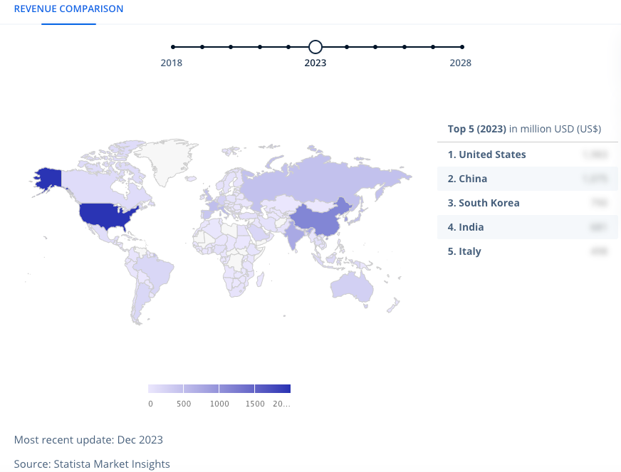
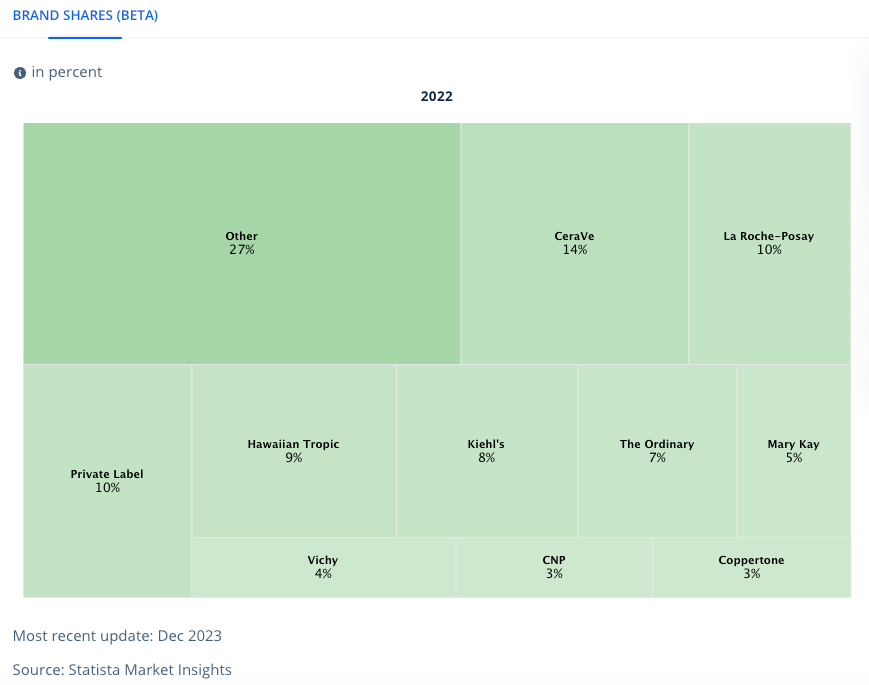
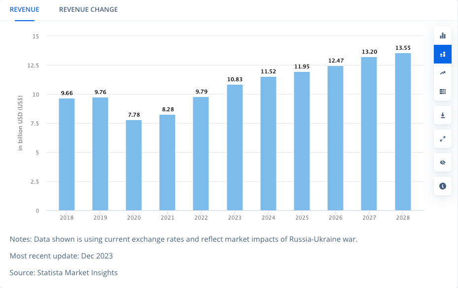

## Executive Summary: New Product Research Study on Sunscreen Products

### Key Findings:

- **Core Functions:** Sunscreens protect the skin from the sun's harmful UV rays by absorbing, reflecting, or scattering them. They are formulated to provide broad-spectrum protection against both UVA and UVB rays.

- **Ideal Product Characteristics:** Ideal sunscreens should be formulated to help maintain a healthy microbiome, provide broad-spectrum protection, have a high SPF (30 or higher), be water-resistant for at least 80 minutes, and be hypoallergenic and non-comedogenic. They should also have a pleasant texture, scent, and color.

- **Unmet Consumer Needs:** Consumers are looking for sunscreens that are safe and effective, but also meet their individual needs and preferences. Some unmet needs include the lack of international regulation, the undefined status of nanoparticles, and the underapplication of sunscreen.

- **Latest Trends:** The latest trends in sunscreen product development include the use of inorganic UV filters, sunscreen sprays, and the application of an ounce of sunscreen to the entirety of exposed skin.

- **Consumer Satisfaction:** Consumers are generally satisfied with current sunscreen products, but there is room for improvement. Factors that contribute to consumer satisfaction include broad-spectrum protection, high SPF, water resistance, and pleasant to use.

- **Opportunities for Improvement:** Sunscreens can be improved to better meet the needs of consumers by using inorganic UV filters, sunscreen sprays, and applying an ounce of sunscreen to the entirety of exposed skin.

- **Current Gaps:** The current gaps in the sunscreen market include the lack of international regulation, the undefined status of nanoparticles, and the underapplication of sunscreen.

- **Challenges and Barriers:** The challenges and barriers to developing new and innovative sunscreen products include the lack of international regulation, the undefined status of nanoparticles, and the underapplication of sunscreen.

- **Market Trends:** The current trends in the sunscreen market include the increasing expenditure on sun protection products and the underapplication of sunscreen.

- **Key Technologies and Advancements:** Key technologies and scientific advancements in sunscreen product development include the use of inclusion complexes using cyclodextrins and the combination of UVB and UVA filters.

- **Opportunities for New Products:** Opportunities for new and innovative sunscreen products include the development of tinted sunscreens with ingredients for particular skin care needs, the use of liposomes to trap charged but hydrophilic substances, and the development of broad-spectrum sunscreens that give UVA protection proportional to UVB protection.

- **Market Size and Growth:** There is no information provided in the context about the current size or projected growth rate of the sunscreen market.

- **Key Factors Driving Growth:** Key factors driving growth in the sunscreen market include the increasing expenditure on sun protection products and the underapplication of sunscreen.
 

 ## Market Forecast 

 ###  Sunscreen Revenue Comparison by Country 2023. 

  

 ### Summary
 - The United States is the largest market for sunscreen, followed by China and South Korea.
- The global sunscreen market is expected to grow from $1.8 billion in 2018 to $3.2 billion by 2023.
- The growth of the sunscreen market is being driven by increasing awareness of the harmful effects of UV radiation and rising disposable incomes in emerging markets.

 ###  Sunscreen Market Share 

  

 ### Summary
 1. Other brands hold the largest market share in sunscreen sales at 27%.

2. Hawaiian Tropic and The Ordinary are the fastest-growing brands in sunscreen sales, with a growth rate of 9% and 7%, respectively.

3. CeraVe is the most popular brand of sunscreen, with a market share of 14%.

 ###  Sunscreen Market Revenue 

  

 ### Summary
 - The sunscreen market is growing and is expected to reach $13.55 billion by 2028.
- The market was negatively impacted by the COVID-19 pandemic, with revenue declining from $10.83 billion in 2023 to $9.79 billion in 2020.
- The market is expected to recover and grow in the coming years, with a CAGR of 5.1%.

